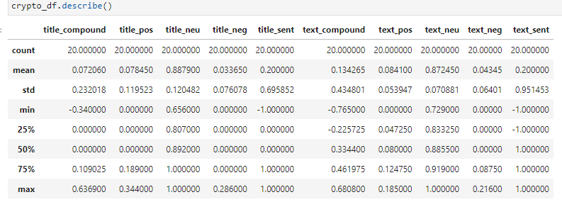
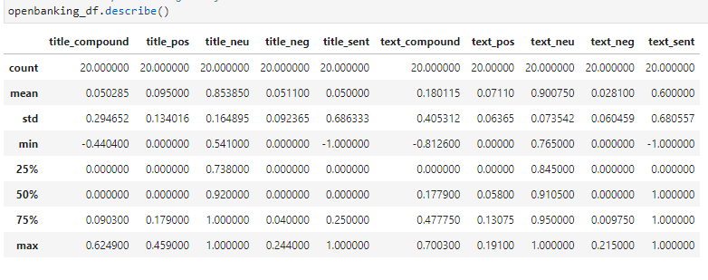
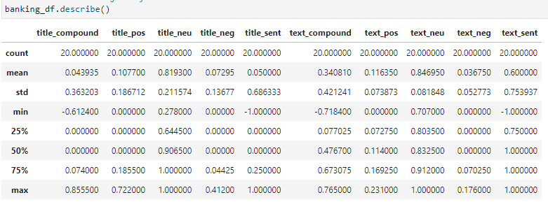

# **FINAL PROJECT**

Project 3  
Presentation Date: March 5, 2022  
Prepared by: Rachel Pierce and Margee Lancaster 

#

## Project Title:
Cryptocurrency, Open Banking, and Banking Sentiment Analysis

#

## Project Team Members:
- Rachel Pierce
- Margee Lancaster

#

## Executive Summary

Fintechs have transformed the way we do banking, transforming payments, lending, and more. Traditional banking is becoming a way of the past, and banks are partnering with Fintech companies to offer innovative products and services to meet consumer demand.  Open banking has become the new way to bank, with third party providers (Fintechs) gaining open access to consumer banking, transaction, and financial data through the use of APIs to provide more innovative products and better customer service. Open banking has also leveraged blockchain technology, and allows customers to connect with the crypto world, such as funding crypto wallets directly from their bank accounts.  
  
While innovative technologies are taking over the banking industry, there is still hesitation to trust new technology.  Our goal for this project is to measure the overall sentiment across three concepts: Cryptocurrency, Open Banking, and Traditional Banking, which will give us insight regarding how the public feels about these three types of banking.  Are consumers still more comfortable with traditional banking?  Or is society embracing technological change and moving towards Open Banking or even crypto?  We shall find out!  

#

## Project Objective and Hypothesis  
  
Our objective is to research news articles using the News API to determine the overall sentiment analysis of three main concepts:
1. Cryptocurrency
2. Open banking 
3. Traditiional banking
  
Given cryptocurrency and blockchain technology have entered the banking system, we want to determine how the banking industry views these three concepts.  We want to know which concept is most popular, which is least popular, and which is the future of banking.

Our hypothesis is that the banking industry is more risk averse and less supportive of cryptocurrency (more negative sentiment). While some banks are offering crypto services, we believe that banks are more comfortable partnering with fintechs to offer crypto services and other innovative technologies rather than developing and offering them through the bank.  We predict that open banking will have the most favorable sentiment of the three concepts.

We plan to answer the following questions:  
1. Does the public have a positive, negative, or neutral sentiment surrounding crypto in banking?
2. Does the public have a positive, negative, or neutral sentiment surrounding open banking?
3. Does the public have a positive, negative, or neutral sentiment surrounding traditional banking?
4. How do these three concepts compare (sentiment analysis)?
5. How do our sentiment analysis results compare to AWS Comprehend?
6. What is our expectation regarding the future of banking?

Techniques used to accomplish our objectives include utilizing applicable pandas libraries, such as nltk, and using a new technology (AWS Comprehend) to compare our sentiment analysis results.

#

## Datasets Used:
We used data obtained from the News API.  
https://newsapi.org/

#

##  Data Phases:
Our process consisted of data exploration,  data preparation, and data cleanup. 
  
- *Data Exploration:* Researched various news APIs.  Selected the NewsAPI and exported crypto, open banking, and banking articles.  
- *Data Preparation:* Sorted through articles for relevant content.  Used Spyder to dig into variables needed.  Exported articles to txt for use in AWS Comprehend.
- *Data Cleanup:*  Tokenized data and filtered out stop words.

Data Issues: 
- NewsAPI limited in characters when pulling content.
- Banking and Open Banking news articles could overlap.
- AWS Comprehend required copy/paste of selected articles.

#

## Presentation 
Our presentation includes the followingi slides, which cover background information related to crypto, open banking, and traditional banking, project objectives and hypothesis, sentiment analysis results, AWS Comprehend demo, and conclusions.  Please refer to the html presentation in GitHub for the presentation deck.  
  
1. Evolution of Banking - The Banking industry is no longer just a brick and mortor bank, we are moving towards blockchain technology and fintech innovation to provide better banking services to meet consumer demand
2. How blockchain technology and partnering with Fintechs is improving banking
3. Bank Use Cases (cattle tracking with blockchain, bank crypto custody services, JP in the metaverse, Visa/MC offering crypto conversion, TassatPay/Network, USDF Consortium, CBDCs)
4. Banks currently using blockchain technology
5. Risks associated with new technologies in banking (BSA/AML, Fair Lending, price risk, operational risks, etc)
6. Benefits of new technologies in banking (faster payments, regulation/public trust, expansion of bank services/customer base, financial inclusion)
7. Project Overview and Hypothesis - Analyze sentiment across three main concepts: Crypto, Open Banking, and Traditional Banking.  Answer 5 Main Questions.
8. Background Slides: What is Crypto?  What is Open Banking? What is Traditional Banking?
9. Techniques Used to Accomplish Objective - Utilizing applicable pandas libraries, such as nltk, and AWS Comprehend
9. Sentiment Analysis Results
10. Ngrams and Frequency Analysis Results
11. AWS Comprehend Demo
12. Overall Conclusion/Answers to 5 Main Questions
13. Data Issues/Improvements/Potential Next Steps

#

## Conclusion:

Our hypothesis that Open Banking would achieve the highest sentiment was inaccurate; however our prediction that crypto would achieve the lowest sentiment was accurate.  Based on our sentiment analysis, the most positive sentiment scores were tied to Traditional Banking. However, these results could be skewed based on overlap between Banking/Open Banking news articles.  Crypto had the lowest sentiment across most analysis results.  
  
Questions Answered:
1. Does the public have a positive, negative, or neutral sentiment surrounding crypto in banking?  
Mixed/Negative
2. Does the public have a positive, negative, or neutral sentiment surrounding open banking?  
Mixed
3. Does the public have a positive, negative, or neutral sentiment surrounding traditional banking?  
Positive
4. How do these three concepts compare (sentiment analysis)?
Based on our analysis, traditional banking has the highest positive scores in most categories.  Crypto and Open Banking were mixed, with some positive, some negative, but crypto was clearly the lowest overall.
5. How does our sentiment analysis results compare to AWS Comprehend?  
**ADD ANSWER HERE**

  
  
  

#

## Difficulties/Implications/Potential Next Steps:*  
  
A few difficulties we encountered during this project was that the NewsAPI limited character content in articles obtained; stop words may not include all necessary stop words; open banking and banking articles may overlap; AWS Comprehend required a copy/paste rather than import of all data.  Potential next steps could include changing Open Banking to Fintechs to determine if results would be clearer, rather than having the potential for overlap with Banking. Also finding a better news API and learning how to import all data into AWS Comprehend.

#

## Workpapers in GitHub
Please refer to the following workpapers in GitHub:
- This **ReadMe** file (Includes a summary of the project)
- **Project3_Presentation.html** file (Class Presentation)
- **Sentiment_Analysis.ipynb** file (Includes all code details)
- **Images** folder (Includes various images included in the project)
#

## References:
- [News API Page](https://newsapi.org/)
- [Fintech Advisory Article](https://www.fintech-advisory.com/news/2021/5/19/why-more-people-choose-crypto-over-traditional-banking)
#
